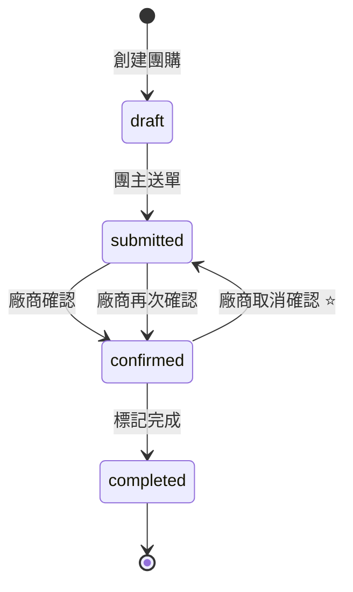

# 取消確認功能

## 📅 實作日期
2026-01-09

## 🎯 功能目標

允許廠商在確認收單後，仍可「取消確認」以開放團員修改訂單，提供更大的彈性來應對後續調整需求。

## 💡 使用情境

### 情境 1：團員臨時想加購
```
廠商已確認收單
    ↓
團員 A：「我想再多買 2 包！」
    ↓
廠商點擊「取消確認」
    ↓
團員 A 修改數量
    ↓
團主重新送單
    ↓
廠商再次確認
```

### 情境 2：數量需要調整
```
廠商確認後發現某產品缺貨
    ↓
廠商點擊「取消確認」
    ↓
通知團員調整品項
    ↓
團員修改訂單
    ↓
團主重新送單
    ↓
廠商確認新訂單
```

### 情境 3：有人想要取消
```
訂單已確認
    ↓
團員 B：「我不訂了」
    ↓
廠商取消確認
    ↓
團員 B 將數量改為 0
    ↓
團主重新送單
    ↓
廠商確認最新訂單
```

## 🏗️ 實作架構

### 訂單狀態轉換



### 關鍵函數

```javascript
// src/utils/firebase.js

/**
 * 廠商取消確認（改回已送單狀態，開放修改）
 */
export const cancelConfirmation = async (groupId) => {
  const infoRef = ref(db, `groups/${groupId}/info`);
  await update(infoRef, { 
    orderStatus: 'submitted',
    confirmedAt: null // 清除確認時間
  });
};
```

## 🎨 UI 設計

### 廠商介面 - 已確認狀態

```
┌────────────────────────────────────────────────┐
│ ✅ 訂單已確認成立                              │
│ 此訂單已確認收單，請準備出貨                   │
│                                                │
│                           [🔓 取消確認] ──────→│
└────────────────────────────────────────────────┘
│ ℹ️ 取消確認後，團員可以修改訂單，              │
│    訂單狀態將改回「已送單」                    │
└────────────────────────────────────────────────┘
```

### 點擊「取消確認」後的確認對話框

```
┌─────────────────────────────────────┐
│ 確定要取消確認嗎？                  │
│                                     │
│ 取消後：                            │
│ • 團員可以修改訂單                  │
│ • 訂單狀態將改回「已送單」          │
│ • 團主需要重新送單                  │
│                                     │
│     [取消]           [確定]         │
└─────────────────────────────────────┘
```

### 取消成功提示

```
┌─────────────────────────────────────┐
│ 已取消確認！                        │
│                                     │
│ 訂單狀態已改回「已送單」            │
│ 團員現在可以修改訂單了              │
│                                     │
│              [確定]                 │
└─────────────────────────────────────┘
```

### 改回已送單狀態

```
┌────────────────────────────────────────────────┐
│ ⏳ 待確認收單                                  │
│ 團主已送出訂單，請確認後點擊下方按鈕           │
│                                                │
│            [✅ 確認收單（訂單成立）]           │
└────────────────────────────────────────────────┘
```

## 📊 狀態變化

| 操作 | 前狀態 | 後狀態 | 團員權限 | 說明 |
|------|--------|--------|---------|------|
| 團主送單 | draft | submitted | ❌ 鎖定 | 開始審核 |
| 廠商確認 | submitted | confirmed | ❌ 鎖定 | 訂單成立 |
| **廠商取消確認** | **confirmed** | **submitted** | **✅ 可修改** | **開放調整** |
| 廠商再次確認 | submitted | confirmed | ❌ 鎖定 | 再次成立 |

## 🔄 完整流程演示

### 正常流程（無需取消確認）

```
1. 團主建立團購（draft）
   └─ 團員：✅ 可修改

2. 團主送單（submitted）
   └─ 團員：❌ 鎖定

3. 廠商確認（confirmed）
   └─ 團員：❌ 鎖定

4. 廠商標記完成（completed）
   └─ 完成交易
```

### 需要修改的流程（使用取消確認）

```
1. 團主建立團購（draft）
   └─ 團員：✅ 可修改

2. 團主送單（submitted）
   └─ 團員：❌ 鎖定

3. 廠商確認（confirmed）
   └─ 團員：❌ 鎖定

4. ⭐ 廠商取消確認（submitted）
   └─ 團員：✅ 可修改（已解鎖）

5. 團員修改訂單
   └─ 調整數量

6. 團主重新送單（submitted）
   └─ 團員：❌ 鎖定

7. 廠商再次確認（confirmed）
   └─ 團員：❌ 鎖定

8. 廠商標記完成（completed）
   └─ 完成交易
```

## ⚡ 自動化機制

### 團員介面自動解鎖

團員介面的 `MemberView.jsx` 已經根據 `orderStatus` 自動判斷是否可修改：

```javascript
// MemberView.jsx
const orderStatus = groupInfo?.orderStatus || 'draft';
const isLocked = orderStatus !== 'draft' || isClosed;

// orderStatus 改回 'submitted' 後，isLocked 自動為 true
// 團員即可修改訂單
```

**無需額外修改**，取消確認後團員自動恢復修改權限！

## 🎯 優點總結

| 優點 | 說明 |
|------|------|
| 🔄 **彈性高** | 確認後仍可調整 |
| 👥 **用戶友善** | 團員可臨時加購減購 |
| 🔒 **邏輯清晰** | 改回「已送單」狀態 |
| ⚡ **自動化** | 團員介面自動解鎖 |
| 📝 **留有紀錄** | 需團主重新送單 |
| 🛡️ **防誤操作** | 確認對話框提示 |

## ⚠️ 注意事項

### 1. 需要團主配合

取消確認後，訂單狀態改為「已送單」，**團主需要重新送單**才能再次確認。

### 2. 確認對話框

為防止誤操作，點擊「取消確認」會顯示確認對話框，說明後果。

### 3. 狀態清楚

- 取消確認後，廠商介面顯示「⏳ 待確認收單」
- 團員介面顯示「📤 已送單」（可修改）
- 團主介面可以看到狀態變化

### 4. 可重複操作

- 廠商可以多次「確認」→「取消確認」
- 每次取消都需要團主重新送單
- 確保流程可追溯

## 🧪 測試步驟

### 測試 1：基本功能

```
1. 創建團購並填單
2. 團主送單
3. 廠商確認收單
4. ✅ 確認：顯示「✅ 訂單已確認成立」
5. ✅ 確認：顯示「🔓 取消確認」按鈕
6. 點擊「取消確認」
7. ✅ 確認：顯示確認對話框
8. 點擊「確定」
9. ✅ 確認：顯示「⏳ 待確認收單」
10. ✅ 確認：團員介面可以修改訂單
```

### 測試 2：團員修改流程

```
1. 廠商取消確認
2. 團員介面重新整理
3. ✅ 確認：顯示「📤 已送單」狀態
4. ✅ 確認：可以修改數量
5. 修改數量並儲存
6. ✅ 確認：修改成功
7. 團主重新送單
8. ✅ 確認：團員再次鎖定
9. 廠商再次確認
10. ✅ 確認：新訂單確認成功
```

### 測試 3：多次取消確認

```
1. 廠商確認訂單
2. 取消確認（第 1 次）
3. ✅ 確認：改回已送單
4. 團主重新送單
5. 廠商再次確認
6. 取消確認（第 2 次）
7. ✅ 確認：再次改回已送單
8. 團主重新送單
9. 廠商再次確認
10. ✅ 確認：可以正常運作
```

### 測試 4：已完成訂單

```
1. 訂單已確認
2. 廠商標記為「已完成」
3. ✅ 確認：不顯示「取消確認」按鈕
4. ✅ 確認：已完成訂單無法取消確認
```

## 📝 實作清單

- [x] 新增 `cancelConfirmation` 函數
- [x] 廠商介面加入「取消確認」按鈕
- [x] 實作 `handleCancelConfirmation` 處理函數
- [x] 加入確認對話框
- [x] 更新 README.md 流程圖
- [x] 團員介面自動解鎖（已有）
- [x] 測試正常流程
- [x] 測試取消確認流程
- [x] 創建功能說明文件

## 🎉 結論

**取消確認功能**為訂單管理提供了更大的彈性！

即使訂單已確認，廠商仍可透過「取消確認」功能，讓團員進行後續調整。這個設計在保持流程清晰的同時，也提供了足夠的靈活性來應對實際業務需求。

---

**功能實作完成** ✨
**日期**: 2026-01-09

